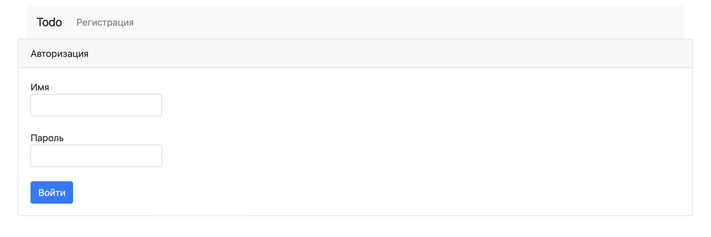
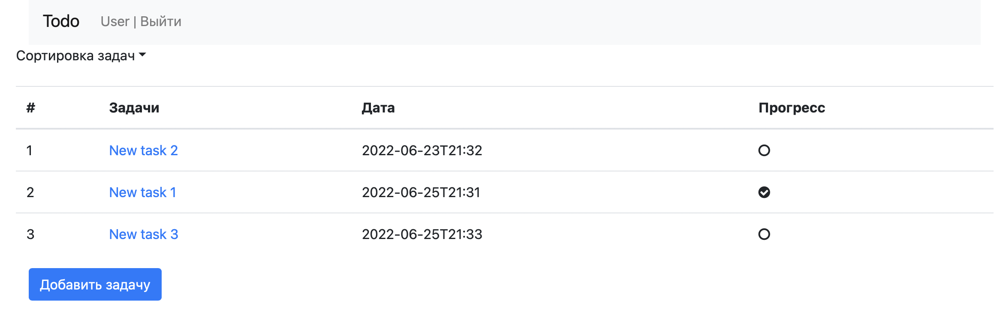
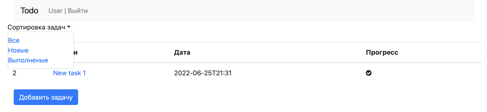
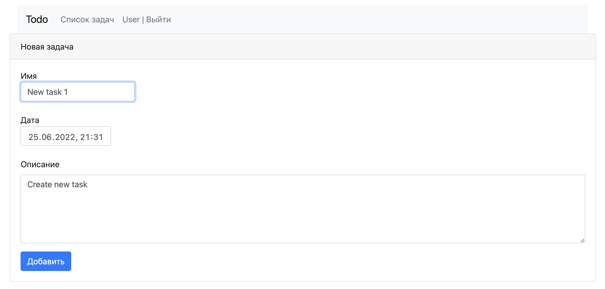
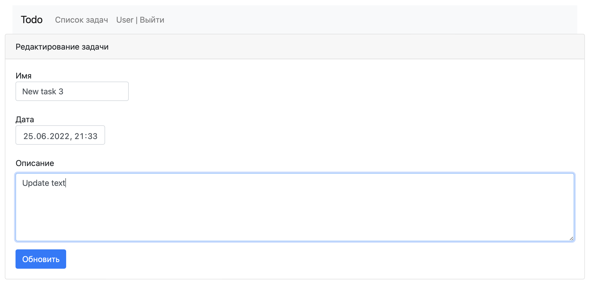

# TODO list

- Приложение для ведения списка задач.
- Задачи можно добавлять, редактировать, удалять и отмечать по мере выполнения задачи.
- Стек технологий:
    * Spring boot
    * Hibernate
    * PostgreSQL
    * Liquibase
    * Bootstrap
    * Thymeleaf

Авторизация и регистрация в приложении

Список задач

Сортировка списка

Добавление задачи

Редактирование задачи

Описание задачи, так же есть кнопки: удаления/редактирования/выполнения

Когда задача выполнена, то видно дату и время выполнения
